## 1.博客介绍

<p align="center">
  <a href="https://www.lstar.icu/">
    
  </a>
</p>

<p align="center">
   基于Springboot + Vue3 + TypeScript 开发的前后端分离博客
</p>

<p align="center">
   <a target="_blank" href="https://gitee.com/lxwise/iris-blog_parent">
      
      
      
      
      
      
      
      
      
      
      
      
       
       
       
   </a>
</p>


## 2.在线地址

**博客链接：** [www.lstar.icu](https://www.lstar.icu)

**后台链接：** [admin.lstar.icu](https://admin.lstar.icu)

**测试账号：** test@qq.com，**密码**：123456

**Gitee 地址：** [https://gitee.com/lxwise/iris-blog_parent](https://gitee.com/lxwise/iris-blog_parent)

**Github 地址：** [https://github.com/lxwise/iris-blog_parent](https://github.com/lxwise/iris-blog_parent)

## 3.Star

ps: 虽然我知道，大部分人和作者菌一样喜欢白嫖，都是看了直接下载源代码后就潇洒的离开。但我还是想请各位喜欢本项目的小伙伴：**Star**，**Star**，**Star**。只有你们的**Star**本项目才能有更多的人看到，才有更多志同道合的小伙伴一起加入完善本项目。请小伙伴们动动您可爱的小手，给本项目一个**Star**。**同时也欢迎大家提交pr，一起改进项目** 。

## 4.目录结构

```
Iris-blog_parent
├── doc    --  说明文档
├── Iris-blog       --  博客后端父项目
	├── Iris-admin  --  博客后端项目
		├── src
			├── main
				├── java
					├── com.iris.blog  		-- 主包
						├── common			-- 通用模块
						├── components		-- 组件
						├── config			-- 通用配置
						├── controller		-- 前端控制器
						├── dao				-- mapper/实体嘞
						├── domain			-- VO类
						├── service			-- 接口
						├── strategy		-- 策略类
						├── utils			-- 工具类
						AdminApplication.java
				├── resources
		pom.xml
	├── Iris-generator		--  代码生成器项目
├── Iris-blog-admin		-- 前端后台项目        
├── Iris-blog-web       -- 前端博客项目
├── sql        --  sql文件
```

## 5.项目特点

- 博客界面布局样式主要参考 Hexo 的 [ShokaX](https://github.com/theme-shoka-x/hexo-theme-shokaX)和 [Butterfly](https://github.com/jerryc127/hexo-theme-butterfly) 设计，页面美观，支持移动端自适应。

- 博客后台管理基于**[yudao-ui-admin-vue3](https://gitee.com/yudaocode/yudao-ui-admin-vue3)**主体框架进行重构，含有动态路由权限、侧边栏、国际化、主题切换等。

- 采用 RABC 权限模型，使用 [Sa-Token](https://gitee.com/dromara/sa-token) 进行权限管理，支持动态权限修改、动态菜单和路由。

- 具有文章，时间线，说说，通知，标签，分类，留言，友链，问题反馈等功能。

- 支持数据流量统计、IP访问监控、服务健康监控、前台网站信息动态管理等功能。

- 支持动态定时任务、动态存储管理（OSS、COS、Kodo、Minio、本地），日志管理等功能。

- 支持文章代码块高亮、图片预览、黑夜模式、点赞、取消点赞，发布评论、回复评论、表情包等功能。

- 发送 HTML 邮件评论回复提醒，内容详细，文章动态通知等功能。

- 接入QQ、Weibo、Gitee、Github等第三方快速登录，减少注册成本。

- 支持文章高级搜索、搜索关键字高亮分词。

- 文章编辑使用 Markdown 编辑器，写法简单便捷。

- 含有实时天气预报、标签云、最新评论、文章目录、文章推荐和文章置顶功能。

- 采用 Restful 风格的 API，注释完善，代码遵循阿里巴巴开发规范，有利于开发者学习。

    

## 6.技术介绍

**前端：** Vue3  +Vite + Pinia + Vue Router + Vueuse + Vue-i18n + Unocss +Iconify  + TypeScript + Axios + Element Plus + Naive UI + Echarts + Swiper

**后端：** SpringBoot + Javafx + Mysql + Redis + Oss/Cos/Qiniu/Minio + Mail + Quartz + Thymeleaf + Nginx + Docker + Sa-Token + Swagger2 + knife4j + MyBatisPlus + lombok + ip2region

**其他：** 接入 QQ、Weibo、Gitee、Github 第三方登录,Hutool、Guava、Commons等工具包

## 7.运行环境

**服务器：** 腾讯云 2 核 4G CentOS7.6

**对象存储：** 阿里云 OSS、腾讯云 COS、七牛云 Kodo、Minio

**最低配置：** 2 核 2G 服务器 ps:如果mysql Redis这些不部署在同一台服务器 1核2G也能运行

## 8.开发环境

|       开发工具        |        说明        |
| :-------------------: | :----------------: |
|         IDEA          | Java 开发工具 IDE  |
|       Webstorm        | 前端 开发工具 IDE  |
|    Navicat/DBeaver    | MySQL 远程连接工具 |
| Redis Desktop Manager | Redis 远程连接工具 |
|      Finalshell       | Linux 远程连接工具 |
|        ApiFox         |    接口调试工具    |
|     SceneBuilder      |   JavaFx开发工具   |

| 开发环境 |  版本   |
| :------: | :-----: |
| OpenJDK  | 17.0.9  |
|  MySQL   | 8.0.11  |
|  Redis   |  6.2.6  |
|  Nginx   | 1.22.1  |
|   Node   | 18.0.02 |
|   Npm    | 10.5.0  |
|   Pnpm   |  9.0.6  |


## 9.本地运行

1. MySQL版本为`8.0.11`，npm版本为`10.5.0`，node版本为`v18.0.02`
2. SQL 文件位于根目录下的`iris_blog.sql`，将其中的数据导入到自己本地数据库中
3. 修改后端application.yml配置文件中的数据库等连接信息，项目中使用到的关于阿里云、腾讯云功能和第三方授权登录等需要自行开通
4. 再`npm install`、`npm run dev`
5. 项目启动后，使用`admin@qq.com`管理员账号登录后台，密码为`123456`

**ps：请先运行后端项目，再启动前端项目，前端项目配置由后端动态加载。**

## 10.项目截图

#### 后台

* **登录页**


* **首页数据大屏**


* **文章管理**


* **黑夜模式首页**


* **文章发布页**


* **分类管理**


* **评论管理**


* **留言管理**

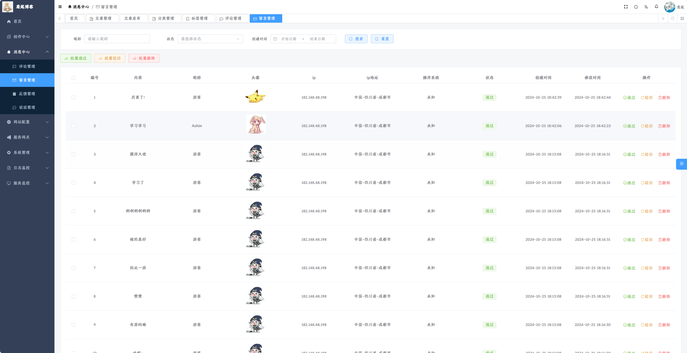

* **说说管理**

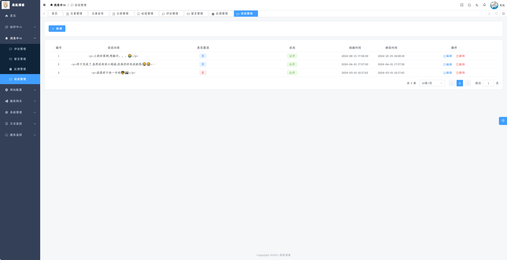

* **网站配置**

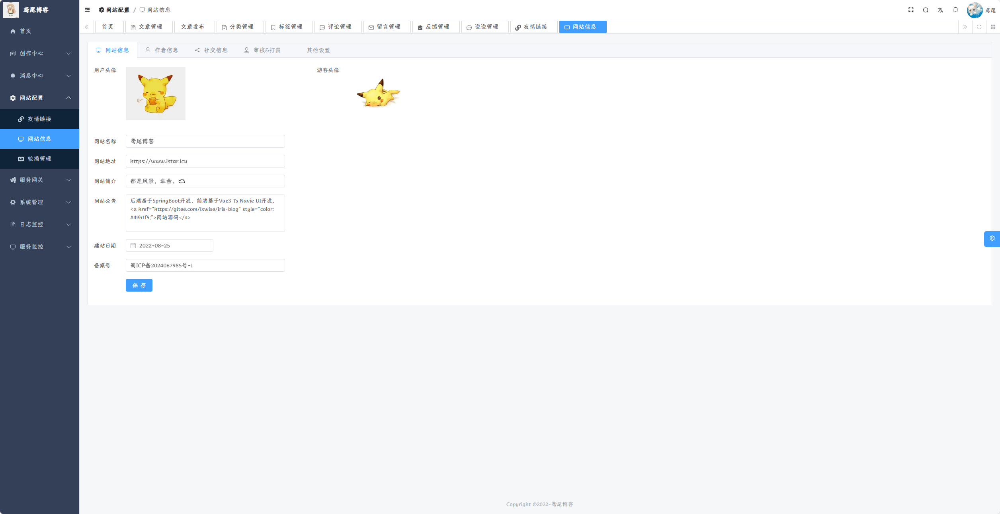

* **轮播图管理**

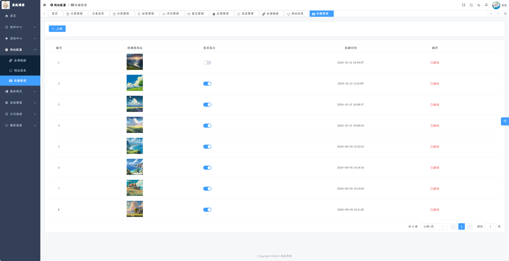

* **网关日志**


* **用户管理**

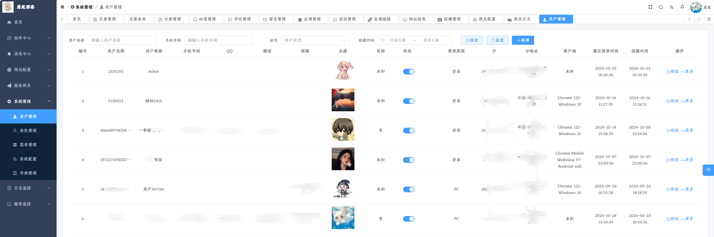

* **菜单管理**


* **字典管理**


* **日志管理**


* **定时任务**

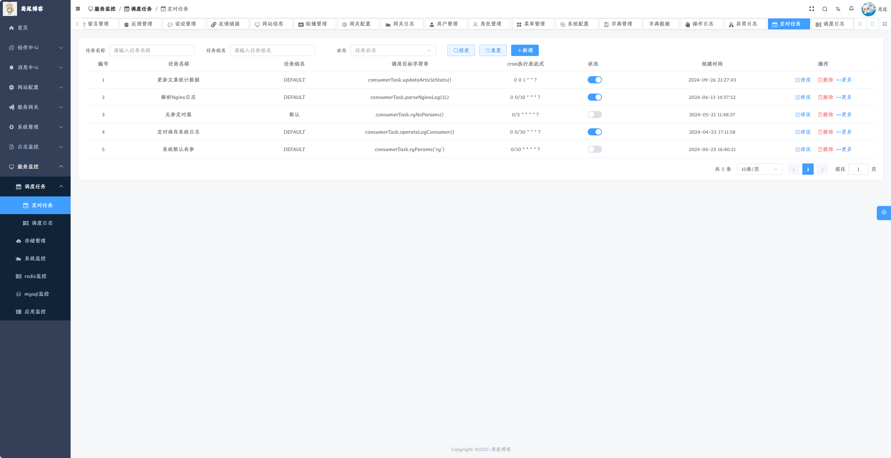


* **存储管理**


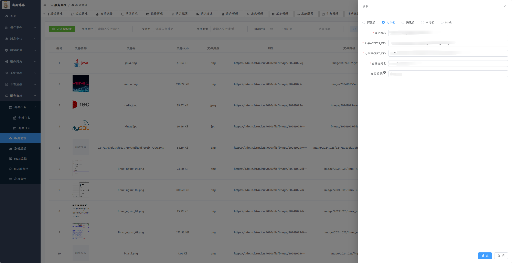

* **Redis监控**


* **应用监控**

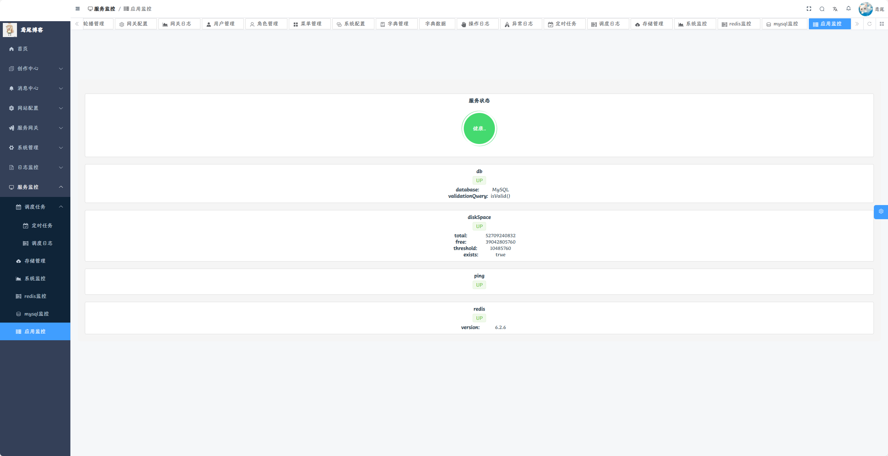

* **Mysql监控**


* **系统监控**

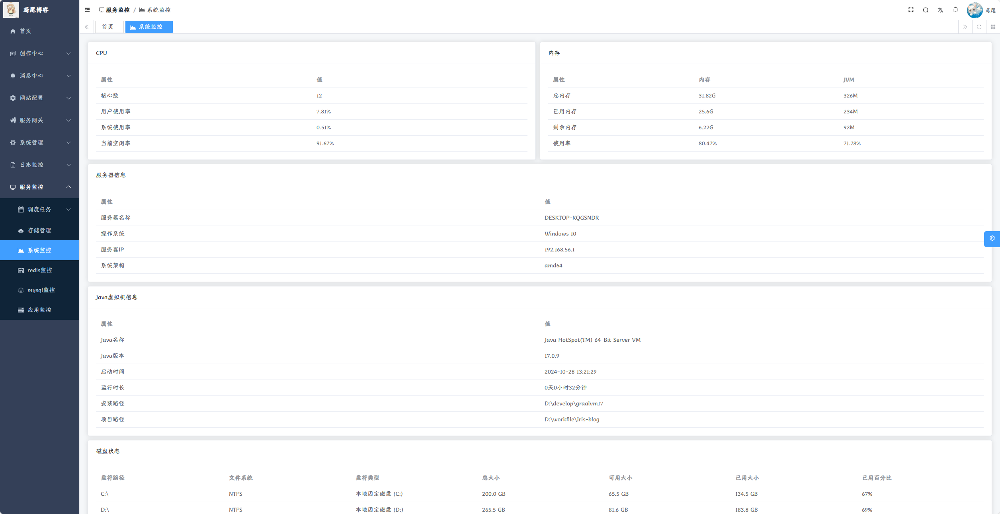


#### 前台

* **首页**


* **明亮模式**


* **暗黑模式**

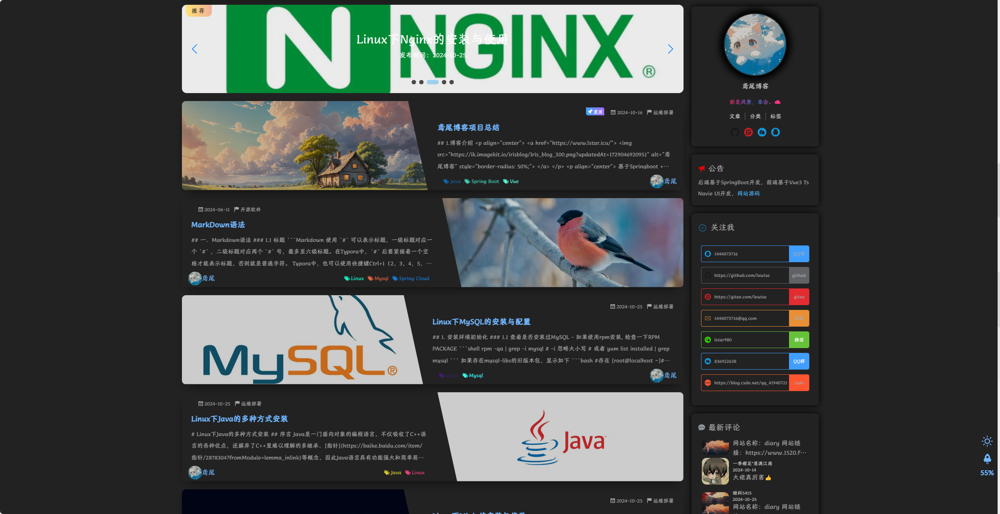

* **文章归档**


* **分类模块**


* **标签模块**


* **说说模块**


* **友链模块**


* **留言板**

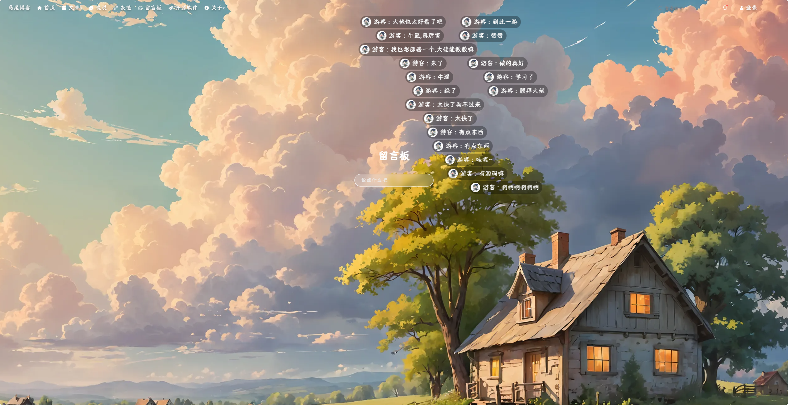

* **用户反馈**


* **消息通知**


* **文章搜索**


* **登录认证**


* **文章详情**


## 11.后续计划

- [ ] 博客文章导入导出
- [ ] 移动端文章目录
- [ ] 新增相册功能
- [ ] 新增看板娘
- [ ] 新增加密文章
- [ ] 优化交互体验

## 12.项目总结

经过数月的努力与探索，我终于完成了自己的博客项目。整个项目花费了大量的心血,从最初的构想到最终的实现，这个过程不仅充满了挑战，也让我学到了很多宝贵的知识和技能。在开发的过程中，我参考了许多优秀的开源项目，它们为我的项目提供了重要的指导和支持。在这里，我想对所有贡献者表示最深的感谢，没有你们的工作，我的项目不可能如此顺利地完成。

- 在此特别感谢以下开源项目的贡献者们，是你们的工作让我的项目得以顺利完成：

  - [hexo-theme-shokaX](https://github.com/theme-shoka-x/hexo-theme-shokaX) 
  -  [hexo-theme-butterfly](https://github.com/jerryc127/hexo-theme-butterfly)
  - **[yudao-ui-admin-vue3](https://gitee.com/yudaocode/yudao-ui-admin-vue3)**
  - [Sa-Token](https://gitee.com/dromara/sa-token) 
  - [基于 Vue.js 的弹幕交互组件](https://github.com/hellodigua/vue-danmaku) 
  - ......

  最后，我希望我的博客项目能够为你带来同样的收获与快乐。如果你有任何建议或意见，欢迎随时联系我。让我们一起分享知识，共同成长！